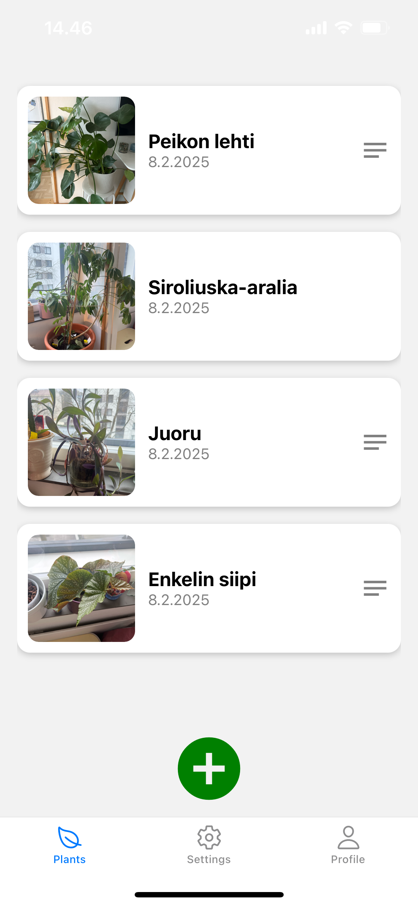

# PlantApp - Plant Tracking App

A mobile app for saving and managing plant photos with details. Built with React Native, Expo, and React Navigation.

 |  | 
:-------------------------:|:-------------------------:|:-------------------------:

## Features
- **List View**: Displants all saved plants with names, dates, and thumbnails. Renders list in batch of 10 to optimize if list is large
- **Scan View**: Capture plant photos via camera, add names/notes, and save to the list.
- **Detail View**: Edit plant details, update photos, and modify notes.
- **Bottom Navigation**: Tabs for List, Settings (placeholder), and Profile (placeholder).

## Technologies
- **React Native** + **Expo**: Cross-platform development.
- **React Context**: State management for plants data.
- **React Navigation**: Bottom tabs and stack navigation.

## Architecture
```
src/
├── contexts/ # Plant state management (add/update plants)
├── navigation/ # Bottom tabs and stack navigators
├── screens/ # App views (List, Scan, Detail, Settings, Profile)
└── App.js # Root component with PlantProvider
```

### Key Technical Decisions:
1. **State Management**:  
   `PlantContext` centralizes plant data with `addPlant` and `updatePlant` methods, ensuring scalability.
2. **Navigation**:  
   - Bottom tabs for primary views.
   - Stack navigation for List → Scan → Detail flows.
3. **Camera Integration**:  
   Expo’s `ImagePicker` handles camera permissions and photo capture.
4. **Temporary Storage**:  
   Data persists in-memory via React Context (resets on app restart).

## How to Run
1. **Prerequisites**:
   - Node.js v18+
   - Expo CLI (`npm install -g expo-cli`)
   - Android/iOS emulator or physical device.

2. **Setup**:
   ```bash
   git clone https://github.com/KimRautiainen/plantApp.git
   cd plantApp
   npm install
   ```
3. **Start**:
4. ```bash
   npm start
   ```
